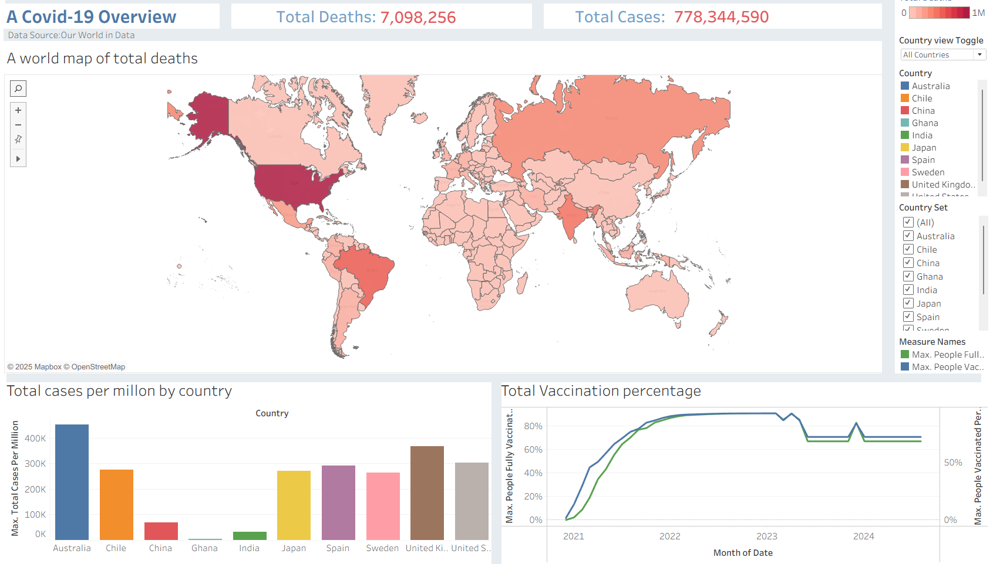

# Covid-Tableau-dashboard

## 📊 Project Overview
This interactive dashboard provides insights into the COVID-19 pandemic across selected countries, focusing on:
- Case and death trends
- Vaccination progress
-  Comparative KPIs

Built in **Tableau** using data from [Our World in Data](https://ourworldindata.org/coronavirus).
## 🛠 Tools & Skills
- Tableau Desktop
- Data cleaning and transformation
- Parameter controls and dynamic filters
- KPI design and dashboard layout

## 🔍 Key Features
- **Interactive filtering**: Compare 10 key countries or view global data.
- **KPI metrics**: Total cases and deaths.
- **Map visualisation**: Geographical spread with focus on selected countries.
- 
## 🌐 Live Dashboard
View the interactive version here: [Tableau Public Link](https://public.tableau.com/app/profile/alistair.evans/viz/Coviddataset_17550087089290/Covid-19Overview?publish=yes)

